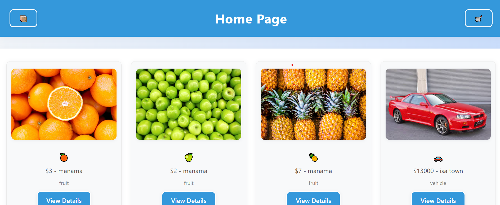

# 🛒 Market-place

A simple online marketplace where users can sign up, log in, list items for sale, and buy items from others. Users can browse through available products and manage their listings securely.

---

## 📦 Features

- User authentication (Sign Up / Sign In)
- Create, Read, Update, and Delete items
- Add items to cart
- Secure password hashing using Bcrypt
- Token-based authentication with JWT
- Server-side rendering with JSX
- Load testing with Artillery
- Testing with Jest & Supertest
- Organized MVC architecture

---

## 🚀 Installation Instructions


### 1. Install the dependencies

```bash
npm install express mongoose dotenv jsx-view-engine method-override
npm install morgan bcrypt jsonwebtoken
npm install --save-dev jest supertest mongodb-memory-server artillery@1.7.9
```

### 2. Run the app

```bash
npm start
```

---

## 📁 File Structure

```
Market-place/
├── controllers/
│   ├── auth/
│   │   ├── dataController.js    
│   │   ├── viewController.js    
│   │   ├── apiController.js     
│   │   └── routeController.js   
│   └── items/
│       ├── dataController.js    
│       ├── viewController.js    
│       ├── apiController.js     
│       └── routeController.js   
├── models/
│   ├── cart.js   
│   ├── db.js    
│   ├── item.js    
│   └── user.js   
├── public/
│   └── styles.css 
├── routes/
│   └── apiRoutes.js
├── test/
│   └── user.test.js
├── views/
│   ├── auth/
│   │   ├── SignIn.jsx     
│   │   └── SignUp.jsx   
│   ├── items/
│   │   ├── Cart.jsx  
│   │   ├── Buy.jsx
│   │   ├── Home.jsx          
│   │   ├── Edit.jsx    
│   │   ├── Index.jsx   
│   │   ├── New.jsx     
│   │   └── Show.jsx  
│   └── layouts/
│       └── Layout.jsx
├── app.js
├── server.js
├── .env
├── .gitignore
├── artillery.yml
└── package.json
```

---

## 📚 Instructional Guide

| **URL** | **HTTP Verb** |  **Action**| **Used For**| **Mongoose Method** | **View** |
|------------|-------------|------------|-------------------------------| ---------------------| ------------- |
| `/marketplace/`         | GET       | index  | Display all items | `Item.find` | `Index.jsx` |
| `/marketplace/new`      | GET       | new | Display form to create item | none | `New.jsx` |
| `/marketplace/:id`      | DELETE    | destroy | Delete item | `Item.findByIdAndDelete` | none |
| `/marketplace/:id`      | PATCH/PUT | update | Update item | `Item.findOneAndUpdate` | none |
| `/marketplace`          | POST      | create | Add new item | `Item.create` | none |
| `/marketplace/:id/edit` | GET       | edit | Edit item form | `Item.findById` | `Edit.jsx` |
| `/marketplace/:id`      | GET       | show | Show specific item | `Item.findById` | `Show.jsx` |

---

## 🔐 Web Routes & Authentication

| Method | Route | Purpose | Auth Required |
|--------|-------|---------|---------------|
| GET | `/users` | Show signup form | ❌ |
| POST | `/users` | Create account | ❌ |
| GET | `/users/login` | Login form | ❌ |
| POST | `/users/login` | Authenticate | ❌ |
| PUT | `/users/:id` | Update profile | ✅ |
| DELETE | `/users/:id` | Delete user | ✅ |
| GET | `/items` | View items | ✅ |
| GET | `/items/new` | Create form | ✅ |
| POST | `/items` | Add item | ✅ |
| GET | `/items/:id` | Item details | ✅ |
| GET | `/items/:id/edit` | Edit item | ✅ |
| PUT | `/items/:id` | Update item | ✅ |
| DELETE | `/items/:id` | Remove item | ✅ |

---

## 🛠️ Technologies Used

- **Node.js & Express.js** – Server
- **MongoDB & Mongoose** – Database
- **JSX View Engine** – Templating
- **Bcrypt** – Password hashing
- **JWT (jsonwebtoken)** – Authentication
- **Method-Override** – Enable PUT & DELETE from forms
- **Jest + Supertest** – Testing
- **Artillery** – Load testing
- **Morgan** – Request logging
- **dotenv** – Environment configuration

---

## 📸 Screenshots / Demo



---

## 🚧 Future Improvements

- Add payment gateway integration
- Implement item reviews and ratings
- Add image upload functionality for listings
- Improve UI/UX styling
- Add category filtering and search

---
